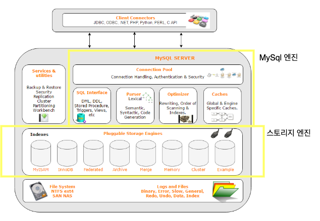
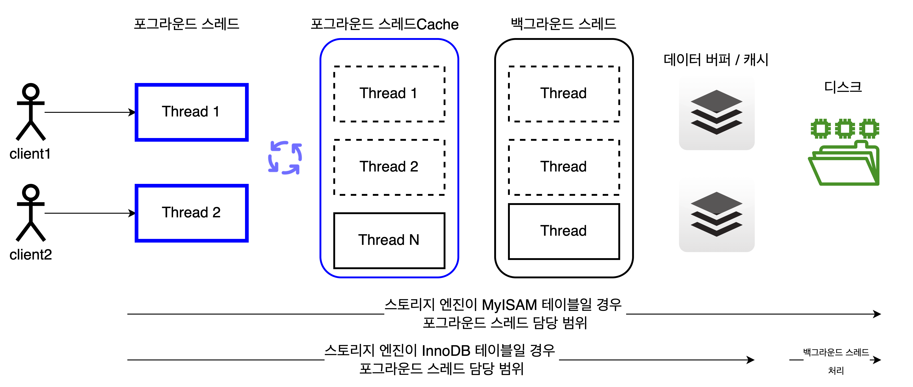

### dockerfile 빌드&실행
```shell
$ DOCKER_BUILDKIT=0 docker build --tag gutenlee-mysql:1.0 .
$ docker run -p 3306:3306 -it -d  fab3f9f42f77
$ docker exec -it dbfb6ced8200 /bin/bash
```
```text
학습 목표:
각 단위 작업을 누가 처리하고 'MySQL 엔진 영역'과 '스토리지 엔진 영역'의 차이
```
# MySQL 아키텍처


- MySQL 엔진 
  - 요청된 SQL 문장을 분석하거나 최적화하는 등 DBMS의 두뇌에 해당하는 처리를 수행
  - 클라이언트로부터의 접속 및 쿼리 요청을 처리하는 커넥션 핸들러
  - SQL 파서 & 전처리기
  - 옵티마이저
- 스토리지 엔진
  - 실제 데이터를 디스크 스토리지에 **저장**하거나 디스크 스토리지부터 데이터를 **읽어오는** 부분을 전담한다. 
  - 핸들러 API
    - MySQL엔진의 쿼리 실행기에서 데이터를 쓰거나 읽기 위해 스토리지 엔진에 요청하는데, 이러한 요청을 핸들러 요청이라 한다.
    - 이때 사용되는 API를 핸들러 API라고 한다. 

# MySQL 스레딩 구조
- MySQL 서버는 프로세스 기반이 아니라 **스레드 기반**으로 작동한다.
- 구분
  - 포그라운드 스레드
  - 백그라운드 스레드

- 포그라운드 스레드
  - 서버에 접속된 클라이언트의 수만큼 존재한다. 
  - 주로 각 클라이언트 사용자가 요청하는 쿼리 문장을 처리한다. 
  - 클라이언트 사용자가 커넥션을 종료하면 담당 스레드는 스레드 캐시로 복귀하는데, 이때 캐시에 일정 개수 이상의 스레드가 대기중이라면 스레드 수 유지를 위해 스레드를 넣지 않고 종료된다.
    - 관련 변수 : thread_cache_size
  - 포그라운드 스레드는 데이터를 MySQL의 데이터 버퍼나 캐시로 부터 가져오며, 버퍼나 캐시에 없는 경우 직접 디스크의 데이터나 인덱스 파일로부터 데이터를 읽어와서 작업 처리를 한다. 
    - MyISAM 테이블 : 디스크 쓰기 작업까지 포그라운드 스레드가 처리함. 
    - InnoDB 테이블 : 데이터 버퍼나 캐시까지만 포그라운드 스레드가 처리하고, 나머지 버퍼로부터 디스크까지 기록하는 작업은 백그라운드 스레드가 처리함.
#
- 백그라운드 스레드
  - 처리 작업
    1. 인서트 버퍼를 병합하는 스레드
    2. 로그를 디스크로 **기록**하는 스레드
    3. InnoDB 버퍼 풀의 데이터를 디스크에 **기록**하는 스레드
    4. 데이터를 버퍼로 읽어 오는 스레드
    5. 잠금이나 데드락을 모니터링하는 스레드  
    -> 모두 중요하지만 그중에서도 가장 중요한 것은 쓰기 스레드다. (b와 c)
#
  - 쓰기 버퍼링 기능
    - 사용자 요청을 처리하는 도중 데이터 쓰기 작업은 지연(버퍼링)되어 처리될 수 있지만 읽기 작업은 절대 지연될 수 없다. 
      - 일반 사용 DBMS에는 대부분 쓰기 작업을 버퍼링해서 일괄 처리하는 기능이 탑재
        - InnoDB : 탑재
        - MyISAM : 미탑재. 사용자 스레드가 쓰기 작업까지 함께 처리하도록 설계되어 있음. **쓰기 버퍼링 기능 사용 불가**.
      
# 메모리 할당 및 사용 구조
| 글로벌 메모리 영영                                                                     | 세션(커넥션) 메모리 영영                                                                                                                                                                   |
|--------------------------------------------------------------------------------|----------------------------------------------------------------------------------------------------------------------------------------------------------------------------------|
| - InnoDB 버퍼 풀<br/> - MyISAM 캐시<br/> - 바이너리 로그 버퍼<br/> - 리두 로그 버퍼<br/> - 테이블 캐시 | - 조인 버퍼<br/> - 정렬 버퍼<br/> - 네트워크 버퍼<br/> - 리드 버퍼                                                                                                                                 |
| MySQL 서버가 시작되면서 운영체제로부터 할당된다. 클라이언트 스레드 수와 무관하며, 모든 스레드에 의해 공유된다.              | - MySQL 서버상에 존재하는 클라이언트 스레드가 쿼리를 처리하는 데 사용하는 메모리 영역.<br/> - 각 클라이언트 스레드별로 독립적으로 할당되며 절대 공유되어 사용되지 않는다.<br/> - 커넥션이 열려 있는 동안 계속 할당된 상태로 남아있는 공간과 쿼리를 실행하는 순간에만 할당했다가 해제하는 공간이 있다. |

# 쿼리 실행 구조

1. 쿼리 파서
   - 사용자의 쿼리 문장을 토큰으로 분리해서 트리 형태의 구조로 만들어 내는 작업
2. 전처리기
   - 파서 과정에서 만들어진 파서 트리를 기반으로 쿼리 문장에 구조적인 문제점이 있는지 확인한다
3. 옵티마이저
   - 쿼리 문장을 저렴한 비용으로 가장 빠르게 처리할지를 결정하는 역할을 담당한다. DBMS의 두뇌에 해당한다
4. 실행 엔진
   - 쿼리 실행 계획를 각 핸들러에게 요청하고, 받은 결과를 또 다른 핸들러 요청의 입력으로 연결하는 역할을 수행
5. 핸들러(스토리지 엔진)
   - 데이터를 디스크로 저장하고 디스크로부터 읽어 오는 역할을 담당
6. 쿼리 캐시
   - 8.0에서 기능이 완전히 제거됨
7. 스레드 풀
   - 내부적으로 사용자의 요청을 처리하는 스레드 개수를 줄여서 동시 처리되는 요청이 많다 하더라도 MySQL 서버의 CPU가 제한된 개수의 스레드 처리에만 집중할 수 있게 해서 서버의 자원 소모를 줄이는 것이 목적이다. 
